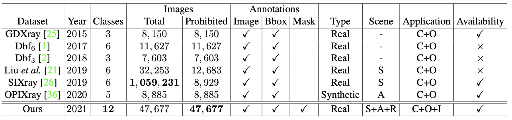
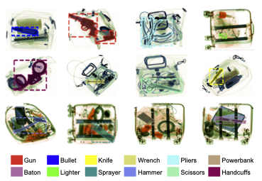
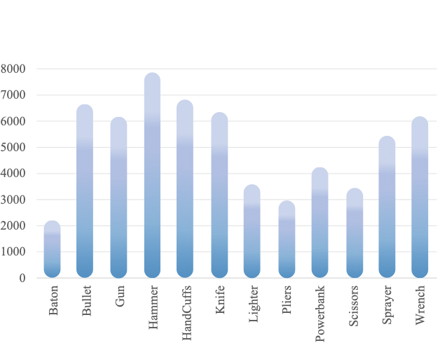
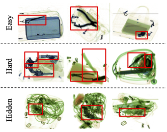
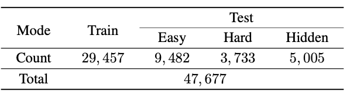
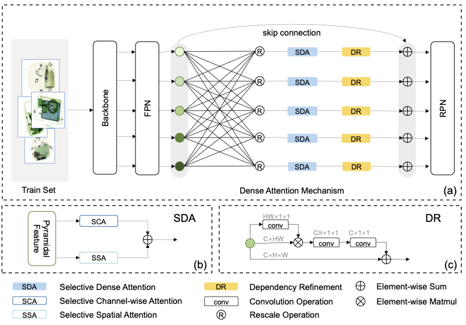
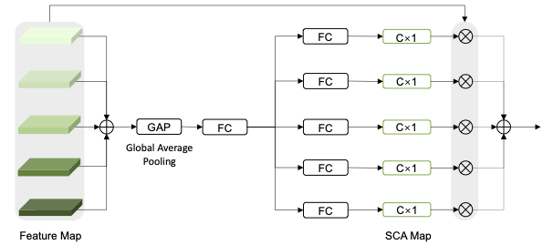
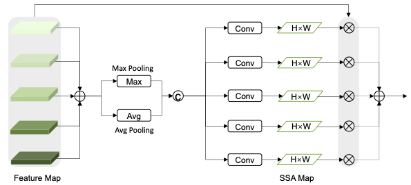
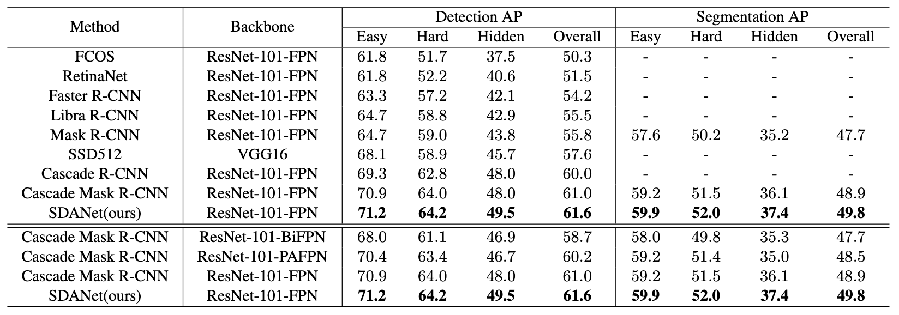

# Towards Real-World Prohibited Item Detection: A Large-Scale X-ray Benchmark(ICCV2021)
This repository is the official implementation of SDANet and PIDray dataset. Paper link: https://arxiv.org/abs/2108.07020.

## Overview
Security inspection is a process of checking assets against set criteria and the evaluation of security systems and access controls to ensure safety, which is important to uncover any potential risks in various scenarios, such as public transportation and sensitive departments. In practice, the inspectors are required to monitor the scanned X-ray images acquired by the security inspection machine to uncover prohibited items, such as guns, ammunition, explosives, corrosive substances, toxic and radioactive substances. However, the inspectors struggle to localize prohibited items hidden in messy objects accurately and efficiently, which poses a great threat to safety.

Towards the prohibited item detection in real-world scenarios, we present a large-scale benchmark, i.e., PIDray, which is formed by 47, 677 images in total. To the best of our knowledge, it is the largest X-ray prohibited item detection dataset to date. Meanwhile, it is the first benchmark aiming at cases where the prohibited items deliberately hidden in messy objects. Besides, we also present the selective dense attention network (SDANet) to construct a strong baseline. 

## PIDray dataset

We compare the existing X-ray benchmarks as follows. “Total” and “Prohibited” indicate the number of total images and the images containing prohibited items in the dataset, respectively. C, O, and I represent Classification, Object Detection, and Instance Segmentation respectively. S, A, and R represent Subway, Airport, and Railway Station respectively.

There are a total of 12 categories of prohibited items defined in the dataset, namely gun, knife, wrench, pliers, scissors, hammer, handcuffs, baton, sprayer, powerbank, lighter and bullet. Each image is provided with image-level and instance-level annotation. For clarity, we show one category per image.

We split all images into 29,457(roughly 60%) and 18,220(remaining 40%) images as training and test sets, respectively. In addition, according to the difficulty degree of prohibited item detection, we group the test set into three subsets, i.e., easy, hard and hidden. Specifically, the easy mode means that the image in the test set contains only one prohibited item. The hard mode indicates that the image in the test set contains more than one prohibited item. The hidden mode indicates that the image in the test set contains deliberately hidden prohibited items.

## Baseline method
We propose the selective dense attention network(SDANet), formed by the dense attention module and the dependency refinement module. The dense attention module is used to capture the discriminative features in both spatial and channel-wise, and the dependency refinement module is construct to exploit the dependencies among multi-scale features.

Extensive experiments are conducted on the proposed dataset to verify the effectiveness of the proposed method compared to the state-of-the-art methods.

Note: Our method is not only applicable to the Cascade Mask R-CNN but also can be extended to other FPN-based detectors. In addition, our method can achieve better performance on the latest MMDetection open-source platform.
## Usage
1. Prerequisites
    
    Python 3.7.10 + CUDA 10.0 + Pytorch 1.1.0 + Torchvision 0.3.0 + MMCV 0.5.9

2.  Dataset

    Baidu Cloud: [Link](https://pan.baidu.com/s/1Q1afq9y0A61QwlCny4ALFQ) Password: 8bhn

    Google Drive: [Link](https://drive.google.com/file/d/1UMq0CP20lKcraOTvsFMjiLjPfDam9jAp/view?usp=sharing)

3.  Clone the repository and install it 

        git clone https://github.com/bywang2018/security-dataset.git
        cd security-dataset
        pip install -r requirements/build.txt
        pip install -v -e .  # or "python setup.py develop"

4. Train

        python tools/train.py configs/sda_cascade_mask_rcnn_fpn_1x.py

5. Evaluation[Weights:[Link](https://drive.google.com/file/d/1ZeXInJdl-GDTAFO-aSUOgWUgsirUuame/view?usp=sharing)]

        python tools/test.py configs/sda_cascade_mask_rcnn_fpn_1x.py <MODEL_PATH>

## Citation
If you find this dataset useful for your research, please cite

    @inproceedings{by2021pidray,
    title={Towards Real-World Prohibited Item Detection: A Large-Scale X-ray Benchmark},
    author={Boying Wang and Libo Zhang and Longyin Wen and Xianglong Liu and Yanjun Wu},
    booktitle={ICCV},
    year={2021}
    }

## License

The images and the corresponding annotations in PIDray Dataset can be used ONLY for academic purposes, NOT for commercial purposes.

Copyright © 2021 Institute of Software Chinese Academy of Sciences, University of Chinese Academy of Sciences

All rights reserved.

